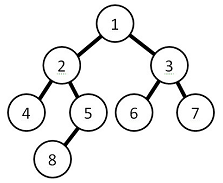

<h1 align="center">
    
</h1>
 
<h1> Parking Lot Tree </h1>

   
   
   
  

> Solving problems of a parking lot with tree.:deciduous_tree:

----

   <a href="#memo-project">Project</a>&nbsp;&nbsp;&nbsp;|&nbsp;&nbsp;&nbsp;
   <a href="#page_with_curl-license">License</a>

## :memo: Project
The project was developed for the discipline of **Data Algorithm and Structure** of the Pontifícia Universidade Católica de Minas Gerais college, 
where the proposal is to develop an algorithm that uses one of the main **data structures** to solve parking lot problems.The structure used was **Tree** with all the necessary functionality,

## :page_with_curl: License
This project is under the [MIT license](https://github.com/danieljpgo/parking-lot-tree/blob/master/LICENSE).

Released in 2019.

README update in 2020.

Developed by [Daniel Jorge](https://github.com/danieljpgo)